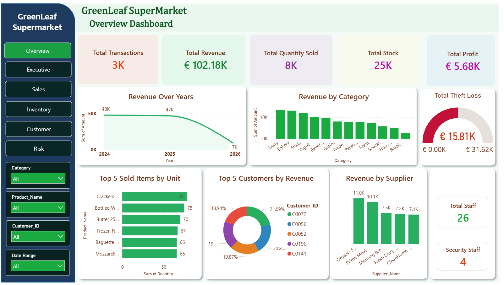
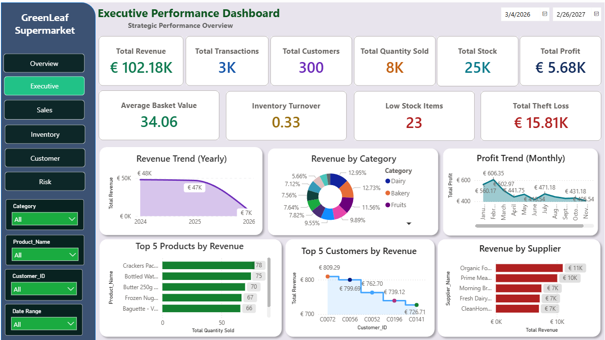
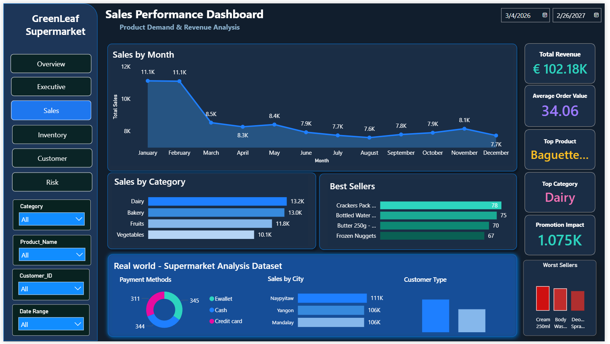
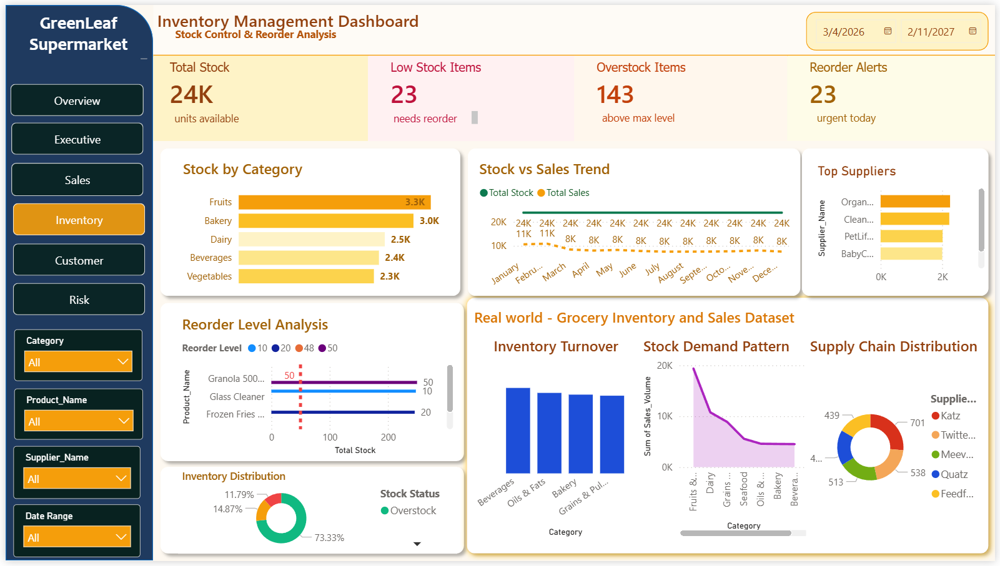
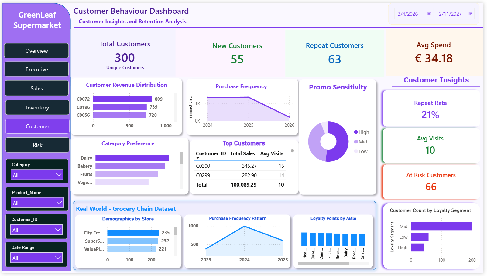
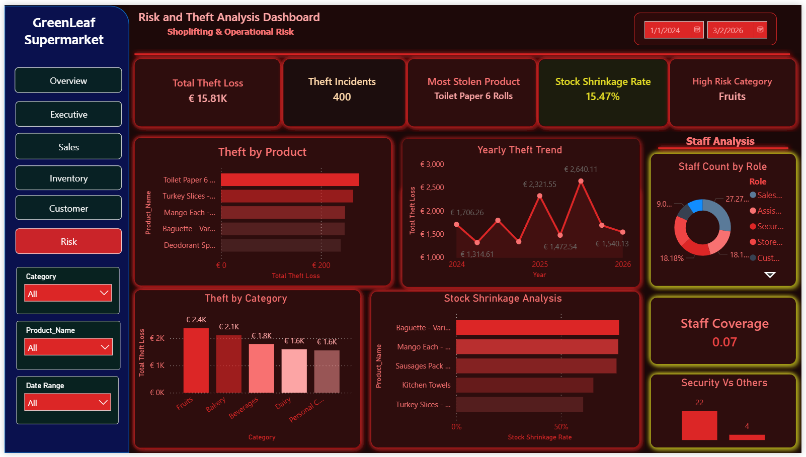

# GreenLeaf Supermarket Analytics
## Power BI Dashboard Project

##  Project Overview

A complete business intelligence solution built in Microsoft Power BI for a fictional supermarket chain. This project covers all 
key business areas through 6 interactive dashboards with full data modelling, DAX measures, and professional UX design.

## Dashboards Built

| Dashboard | Description |
|-----------|-------------|
| 01 Overview | Business health snapshot |
| 02 Executive | Strategic KPIs for leadership |
| 03 Sales | Revenue trends and performance |
| 04 Inventory | Stock control and reorder alerts |
| 05 Customer | Behaviour and retention analysis |
| 06 Risk | Theft loss and shrinkage tracking |

## Key Business Insights Found

- Revenue declining from €48K to €7K 
  (2024 to 2026) — needs urgent attention
- €15,810 lost to theft across 400 incidents
- Only 21% customer repeat rate 
  — retention strategy needed
- 23 products need urgent reordering
- Inventory turnover of 0.33 
  — stock moving too slowly
- Fruits is highest theft risk category

## Key Metrics Tracked

- Total Revenue: €102.18K
- Total Transactions: 3,000
- Total Customers: 300
- Total Stock: 25K units
- Total Profit: €5.68K
- Average Basket Value: €34.06
- Total Theft Loss: €15.81K
- Stock Shrinkage Rate: 15.47%

## Tools and Technologies Used

- Microsoft Power BI Desktop
- DAX (Data Analysis Expressions)
- Power Query (M Language)
- Data Modelling (Star Schema)
- UX Dashboard Design

## Skills Demonstrated

- Data Cleaning and Transformation
- Data Modelling and Relationships
- DAX Measures and Calculations
- Time Intelligence Functions
- Interactive Dashboard Design
- Business Insight Generation
- KPI Design and Reporting
- Risk and Loss Analysis

## Dashboard Screenshots

### Overview Dashboard

### Executive Dashboard

### Sales Dashboard

### Inventory Dashboard

### Customer Dashboard

### Risk Dashboard

## Contact

- LinkedIn: http://linkedin.com/in/rohith-mon-k-r-3a89831a0
- Email: rohithkallampallil@gmail.com
- Location: Dublin, Ireland
- Status: Open to Data Analyst roles

---

## Tags

Power BI | DAX | Data Analytics | 
Business Intelligence | Data Visualisation | 
Retail Analytics | Portfolio Project
